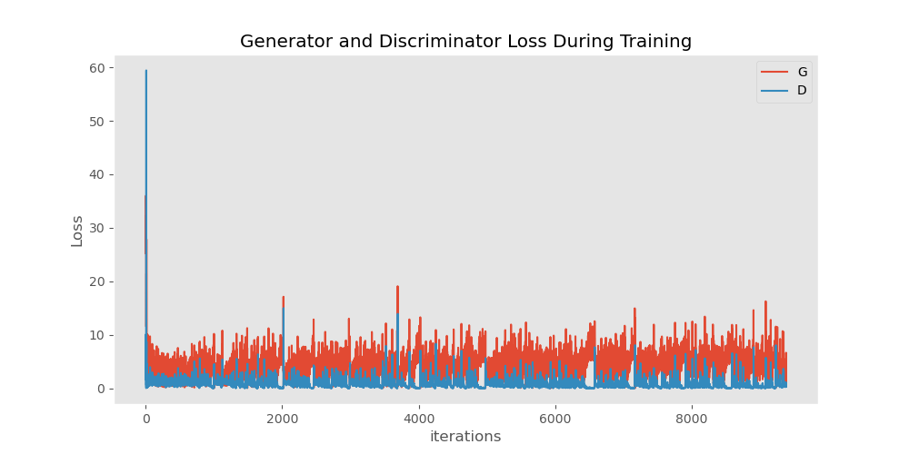
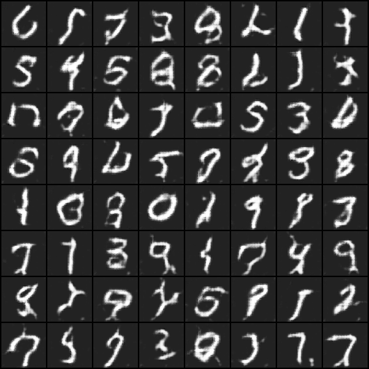
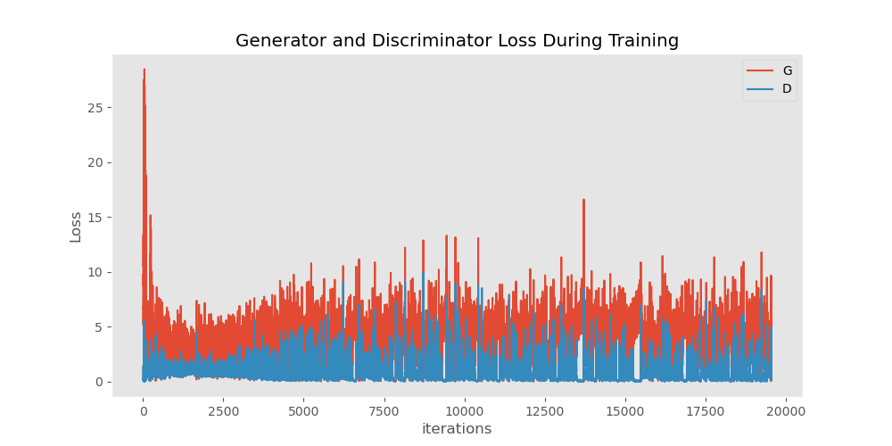
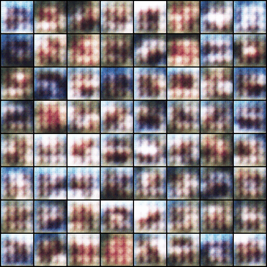

# DCGAN生成式网络

本项目主要使用`Pytorch`深度学习框架，可视化工具依旧选择的是`tensorboard`


下表数据为最后一轮的结果。

|   数据集   | DLoss | GLoss |    结果展示     |
|:-------:|:-----:|:-----:|:-----------:|
| CIFAR10 | 0.27  | 5.43  | [效果1](#1.1) |
|  MNIST  | 1.04  | 0.57  | [效果2](#1.2) |


使用方式
首先拉下来仓库代码，在终端中输入下面命令，查看训练过程中的效果变化，你也可以点击表格上面的效果查看动图效果。
```bash
tensorboard --logdirs=runs
```

## MNIST

_生成手写体数字识别_ 就是`GAN`原论文里面的相关试验内容，这里我使用`DCGAN`去复现效果。

相关文件
> - [MNIST_train.py](MNIST_train.py)

因为`MNIST`数据集中本身就是灰度图，所以我们需要将 $nc = 1$
### Loss

**从名字上看，我们就知道名称为对抗，所以loss存在一个波动的样子，但是整体是一个下降趋势。**

<h3 id="1.1">效果</h3>



## CIFAR10
`CIFAR10`数据集不同于前面的`MNIST`数据集，它不再是一个灰度图，而是具有*3*通道的*RGB*。
所以我们需要设置 $nc = 3$

相关文件
> - [cifar10_train.py](cifar10_train.py)

### Loss


<h3 id="1.2">效果</h3>


